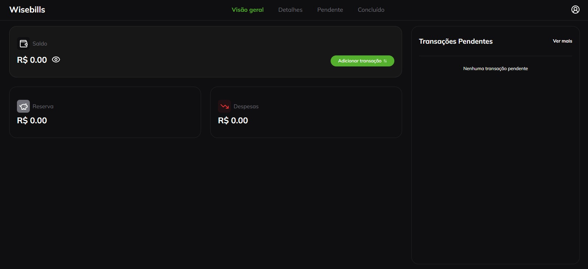

<h1 align="center" style="font-weight: bold;">Wisebills (Front-end) 💻</h1>

 <a href="#tech">Tecnologias</a>

    Uma aplicação web, desenvolvida seguindo os princípios de mobile first, com o objetivo de facilitar a organização e o gerenciamento financeiro do usuário.

     <a href="https://wisebills-coral.vercel.app/" target="_blank">Visite este Projeto</a>

<h4 align="center">🚧 Projeto em construção...  🚧</h4>

<h2 id="layout">🎨 Layout</h2>

<h2 id="tech">💻 Tecnologias</h2>

- Next.js
- Typescript
- Tailwindcss
- Lucide React
- ShadcnUI
- Zod
- React Hook Form
- Zustand